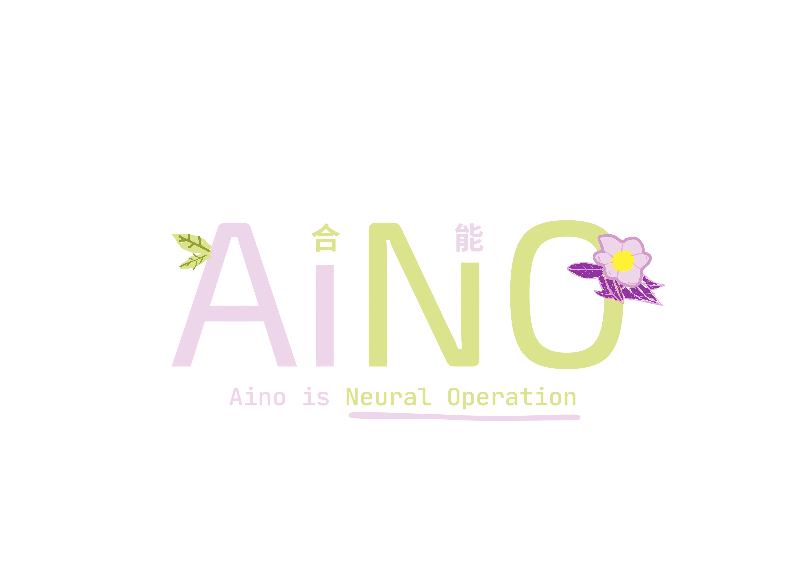

# AINO (Aino is Neural Operation)


> **"Aino is Neural Operation."** > A custom-built Deep Learning framework built from scratch using pure Python and NumPy.

---

## 🌟 Inspiration

This project was born out of curiosity after watching this inspiring video:  
[**MIT Introduction to Deep Learning | 6.S191**](https://youtu.be/alfdI7S6wCY?si=MPqH4F2EiP3U67t-)

I didn't want to just "import tensorflow" and call it a day. I wanted to see **directly** how the magic happens under the hood. I wanted to feel the weight of the matrices, understand the flow of the gradients, and build the brain neuron by neuron.

## The Tech Stack

So, I built AINO using **only NumPy**.

* **No Black Boxes:** Every Forward Pass and Backpropagation step is manually calculated.
* **Modular Design:** Built with Object-Oriented Programming (Perceptron -> Layer -> NeuralNetwork).
* **Custom File Format:** Saves and loads trained models using the custom `.dit` format.

## Features

* **Flexible Architecture:** Define any number of layers and neurons (e.g., `[3, 20, 10, 1]`).
* **Activation Functions:** Supports `Sigmoid`, `ReLU`, `Tanh`, and more soon.
* **Tasks:** Capable of both **Classification** (e.g., Iris Dataset) and **Regression** (e.g., Rocket Trajectory Prediction).
* **Training Engine:** Includes `.fit()` and `.predict()` methods similar to Scikit-Learn.

## 🧠 What I Learned

Building AINO from the ground up gave me insights that high-level libraries often hide:

1.  **Object-Oriented Neural Architecture:**
    Instead of abstract tensors, I built the network hierarchically. I learned how a **Neural Network** manages **Layers**, and how a **Layer** orchestrates individual **Perceptrons**. This OOP approach helped me visualize exactly how data flows through the structure.

2.  **The Calculus of Backpropagation:**
    I implemented the **Chain Rule** manually. By coding the `backward()` method in `Layer` and `update_weight()` in `Perceptron`, I understood how error gradients propagate from the output back to the input, and how weights ($w$) and biases ($b$) are adjusted using the learning rate ($n$).

3.  **Activation Functions & Derivatives:**
    I manually coded the mathematical formulas for **Sigmoid**, **Tanh**, and **ReLU**, along with their specific derivatives needed for the gradient descent step. I learned why ReLU is crucial for preventing vanishing gradients in deeper networks.

4.  **NumPy Vectorization:**
    Handling matrix multiplication (`np.dot`) and shape alignment was challenging. I learned how to efficiently process inputs and weights as vectors rather than looping through every single value.

5.  **Model Serialization (The `.dit` Format):**
    I learned how to persist state. By implementing the `save()` and `load()` methods, I figured out how to extract weights/configs from objects, store them in a binary format (`.npz`), and reconstruct the exact object architecture from that file later.
## 💻 Usage Example

```python
import aino

model = aino.NeuralNetwork([2, 3, 1], activation_type='sigmoid')
model.fit(X_train, y_train, epochs=100, n=0.1)
model.predict(X_test)
model.save('aino.dit')

```

Built with ❤️ and use Python and Numpy.

